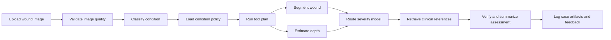

# WoundMind

[](#local-setup)
[](#run-locally)
[](#run-locally)
[](#safety-note)

WoundMind is a diagnostic assistant agent for wound assessment research. It combines image-model tools, human-in-the-loop review, clinical policy routing, and reference retrieval into a traceable workflow for diabetic foot ulcers, pressure injuries, and related skin/wound conditions.

## Safety Note

WoundMind is a research prototype. It is not a medical device and is not for clinical diagnosis.

## What It Does

| Capability | Current implementation |
| --- | --- |
| Condition triage | ConvNeXt-Tiny classifier over 18 wound/skin condition classes |
| Wound localization | U-Net++ segmentation wrapper with mask preview and mask-area summary |
| Depth signal | Depth Anything V2 relative-depth wrapper with ROI-aware previews |
| Severity routing | DFU and pressure-injury severity model selection across RGB, mask, depth, and combined inputs |
| Agent orchestration | Tool planner, policy registry, verifier state, case logger, simulated clinician Q&A |
| Clinical grounding | Local clinical reference index plus condition-gated retrieval policy |
| Human review | Streamlit workflow and static browser prototype for accepting or overriding model outputs |

## Agent Workflow



The agent can run deterministically without an LLM key. OpenAI-backed brain/verifier paths are configured behind the same interface for later expansion.

## Repository Layout

```text
app/
  main.py                  FastAPI service entrypoint
  pipeline.py              Multi-stage wound analysis pipeline
  models/                  Condition, segmentation, depth, severity wrappers
  agent/                   Tool planner, memory, verifier, policy, case logging
  routing/                 DFU/PI severity model routing rules
  preprocessing/           Image loading, transforms, validation

frontend/
  streamlit_app.py         Human-in-the-loop workflow UI
  static-demo/             Browser prototype for API-driven demo flow

scripts/
  ingest_docs.py           Clinical reference ingestion
  dev/                     Local demo and maintenance scripts

chroma_db/                 JSON fallback clinical reference index
clinical_docs/             Text references and source manifest; PDFs stay local
docs/                      Architecture, checkpoint, and development notes
tests/                     Smoke and preprocessing tests
```

## Local Setup

```bash
git clone https://github.com/jxia622/WoundMind.git
cd WoundMind
make setup
cp .env.example .env
```

Large model weights are not committed to git. Place them under `checkpoints/` using the paths in [docs/CHECKPOINTS.md](docs/CHECKPOINTS.md).

## Run Locally

Run the API and static browser prototype:

```bash
make start-demo
```

Open:

- API health: http://localhost:8000/health
- Swagger: http://localhost:8000/docs
- Static demo: http://localhost:4173

Run the Streamlit workflow:

```bash
make streamlit
```

Useful development commands:

```bash
make api
make status-demo
make stop-demo
make validate
```

## API Surface

| Endpoint | Purpose |
| --- | --- |
| `POST /validate-image` | Basic image quality and format checks |
| `POST /predict-condition` | Top-k condition prediction |
| `POST /generate-mask` | U-Net++ wound mask generation |
| `POST /generate-depth` | Depth Anything V2 depth preview generation |
| `POST /predict-severity` | DFU/PI severity routing and inference |
| `POST /analyze` | Default end-to-end pipeline |
| `POST /agent/analyze` | Agent-mediated analysis with policy and retrieval context |
| `POST /feedback` | JSONL feedback logging |

## Documentation

- [Architecture](docs/ARCHITECTURE.md)
- [Checkpoint placement](docs/CHECKPOINTS.md)
- [Development guide](docs/DEVELOPMENT.md)

## Design References

The README structure follows common patterns used by mature agent repos: a compact product definition, capability table, quickstart, architecture diagram, API surface, and roadmap. The goal is to make the repo understandable before a reader opens the code.

## Not Yet Built

- Independent clinical validation with reviewed wound datasets and clinician-labeled outcomes.
- Production-grade authentication, authorization, PHI-safe storage, audit logging, and monitoring.
- Remote checkpoint hosting plus reproducible model-artifact download scripts.
- Fully automated clinician follow-up flow beyond the current simulated/context-driven Q&A helper.
- Unified production UI that replaces the split Streamlit and static demo surfaces.
- Prospective safety evaluation, calibration review, and clinician sign-off workflow.
