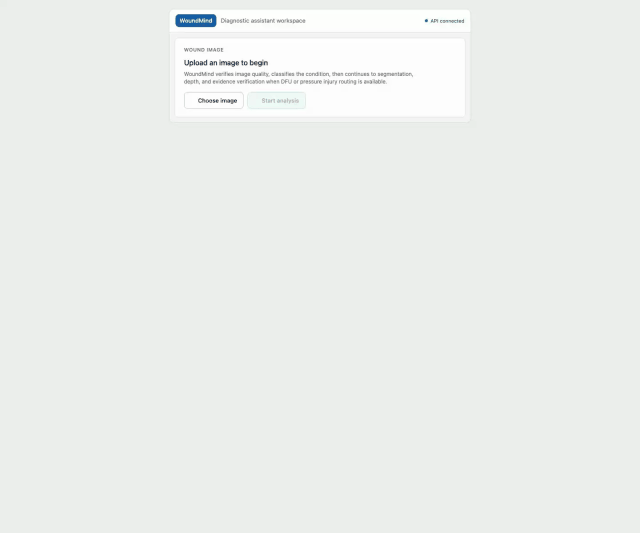
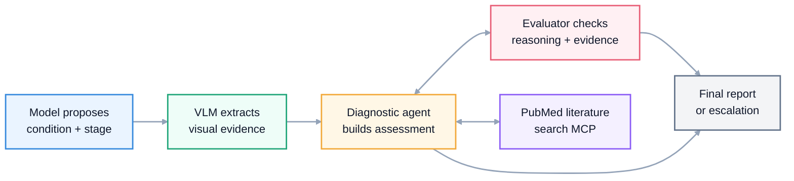

# WoundMind

[](#local-setup)
[](#run-locally)
[](#run-locally)
[](#safety-note)

WoundMind is a diagnostic assistant agent for wound assessment research. The current demo runs a one-way image workflow: verify image quality, classify the wound condition with an override dropdown, show a light-blue segmentation overlay beside a relative depth map, then run a traceable full-agent evaluation for DFU and pressure-injury staging.

## Demo



[Watch the WoundMind DFU Grade 3 demo](docs/assets/woundmind_dfu_grade3_demo.webm)

The demo uses a diabetic foot ulcer image and shows the local UI returning a DFU condition prediction, Grade 3 severity result, confidence/probability summaries, a blue segmentation overlay on the original wound image, a side-by-side depth map, and a full diagnostic-agent trace with retrieved evidence and verifier output.

## Safety Note

WoundMind is a research prototype. It is not a medical device and is not for clinical diagnosis.

## What It Does

| Capability | Current implementation |
| --- | --- |
| Condition triage | ConvNeXt-Tiny classifier over 18 wound/skin condition classes |
| Wound localization | U-Net++ segmentation wrapper with light-blue mask overlay on the original wound image and mask-area summary |
| Depth signal | Depth Anything V2 relative-depth wrapper shown side-by-side with the segmentation overlay |
| Severity routing | DFU and pressure-injury severity model selection across RGB, mask, depth, and combined inputs |
| Agent orchestration | Full diagnostic-agent run with tool planner, VLM visual evidence extraction, PubMed retrieval, evaluator loop, trace steps, case logger, and simulated clinician Q&A |
| Clinical grounding | PubMed clinical MCP retrieval by default, with an optional local index only for offline development |
| Human review | Static browser prototype and Streamlit workflow for condition override, visual review, and final agent output inspection |

## Agent Workflow

```mermaid
flowchart LR
    A["Wound image"]:::input
    B["Condition<br/>classification"]:::model
    C["Condition-aware<br/>tool orchestration"]:::agent
    D["Candidate diagnosis<br/>+ visual findings"]:::finding
    E["Evidence verification<br/>agent"]:::verify
    F["Report or<br/>escalation"]:::output

    A --> B --> C --> D --> E --> F

    classDef input fill:#eaf4ff,stroke:#378add,stroke-width:2px,color:#0f172a;
    classDef model fill:#eefdf8,stroke:#21a67a,stroke-width:2px,color:#0f172a;
    classDef agent fill:#fff7e6,stroke:#f2a93b,stroke-width:2px,color:#0f172a;
    classDef finding fill:#f4f0ff,stroke:#8b5cf6,stroke-width:2px,color:#0f172a;
    classDef verify fill:#fff0f3,stroke:#e85d75,stroke-width:2px,color:#0f172a;
    classDef output fill:#f3f4f6,stroke:#64748b,stroke-width:2px,color:#0f172a;
    linkStyle 0,1,2,3,4 stroke:#94a3b8,stroke-width:2px;
```



The core agent path is auditable: WoundMind classifies the condition, routes condition-aware tools such as segmentation and depth, extracts visual findings with an OpenAI vision model when configured, retrieves evidence through the PubMed clinical MCP, runs a diagnostic-agent/evaluator loop against PMID-backed literature chunks, and returns either a report or escalation recommendation.

### Verification Agent System Design

This diagram shows the intended verification-agent system design, not a line-by-line code execution trace.



The verification agent uses the model's proposed condition and stage as a starting point, asks a VLM to extract visual findings, and then has the diagnostic agent and evaluator iterate until the claim is supported, contradicted, or flagged as uncertain. At runtime, WoundMind calls the PubMed clinical MCP `search_and_fetch_pubmed` tool for external evidence; the evaluator can request targeted follow-up retrieval before the final report or escalation.

## Repository Layout

```text
app/
  main.py                  FastAPI service entrypoint
  pipeline.py              Multi-stage wound analysis pipeline
  models/                  Condition, segmentation, depth, severity wrappers
  agent/                   Tool planner, PubMed MCP adapter, verifier, policy, case logging
  routing/                 DFU/PI severity model routing rules
  preprocessing/           Image loading, transforms, validation

frontend/
  streamlit_app.py         Human-in-the-loop workflow UI
  static-demo/             Browser prototype for API-driven demo flow

scripts/
  ingest_docs.py           Optional offline clinical reference ingestion
  dev/                     Local demo and maintenance scripts

chroma_db/                 Optional offline JSON fallback clinical reference index
clinical_docs/             Optional offline text references and source manifest
docs/                      Architecture, checkpoint, and development notes
tests/                     Smoke and preprocessing tests
```

## Local Setup

```bash
git clone https://github.com/jxia622/WoundMind.git
cd WoundMind
make setup
cp .env.example .env
```

Large model weights are not committed to git. Place them under `checkpoints/` using the paths in [docs/CHECKPOINTS.md](docs/CHECKPOINTS.md).

The full verification agent expects the PubMed MCP server project next to this repository by default:

```bash
git clone https://github.com/jxia622/pubmed-clinical-mcp.git ../pubmed-clinical-mcp
```

Override `PUBMED_MCP_PROJECT_PATH` in `.env` if the MCP lives somewhere else. Set `LITERATURE_RETRIEVAL_BACKEND=local` only when intentionally testing the offline local clinical-doc index.

## Run Locally

Run the API and static browser prototype:

```bash
make start-demo
```

Open:

- API health: http://localhost:8000/health
- Swagger: http://localhost:8000/docs
- Static demo: http://localhost:4173

Run the Streamlit workflow:

```bash
make streamlit
```

Useful development commands:

```bash
make api
make status-demo
make stop-demo
make validate
```

## API Surface

| Endpoint | Purpose |
| --- | --- |
| `POST /validate-image` | Basic image quality and format checks |
| `POST /predict-condition` | Top-k condition prediction |
| `POST /generate-mask` | U-Net++ wound mask generation |
| `POST /generate-depth` | Depth Anything V2 depth preview generation |
| `POST /predict-severity` | DFU/PI severity routing and inference |
| `POST /analyze` | Default end-to-end pipeline |
| `POST /agent/analyze` | Agent-mediated analysis with policy and retrieval context |
| `POST /feedback` | JSONL feedback logging |

## Documentation

- [Architecture](docs/ARCHITECTURE.md)
- [Checkpoint placement](docs/CHECKPOINTS.md)
- [Development guide](docs/DEVELOPMENT.md)

## Design References

The README structure follows common patterns used by mature agent repos: a compact product definition, capability table, quickstart, architecture diagram, API surface, and roadmap. The goal is to make the repo understandable before a reader opens the code.

## Not Yet Built

- Independent clinical validation with reviewed wound datasets and clinician-labeled outcomes.
- Production-grade authentication, authorization, PHI-safe storage, audit logging, and monitoring.
- Remote checkpoint hosting plus reproducible model-artifact download scripts.
- Fully automated clinician follow-up flow beyond the current simulated/context-driven Q&A helper.
- Unified production UI that replaces the split Streamlit and static demo surfaces.
- Prospective safety evaluation, calibration review, and clinician sign-off workflow.
