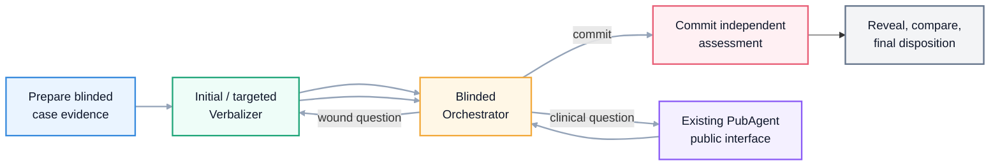

# WoundMind

[](#local-setup)
[](#run-locally)
[](#run-locally)
[](#safety-note)

WoundMind is a diagnostic assistant for wound assessment research. The current demo runs a one-way image workflow: verify image quality, classify the wound condition with an override dropdown, show a light-blue segmentation overlay beside a relative depth map, then run a traceable two-pass blinded evaluation for DFU and pressure-injury staging.

## Demo


[Watch the WoundMind DFU Grade 3 demo](docs/assets/woundmind_dfu_grade3_demo.webm)

The demo uses a diabetic foot ulcer image and shows the local UI returning a DFU condition prediction, Grade 3 severity result, confidence/probability summaries, a blue segmentation overlay, a side-by-side depth map, the blinded LangGraph trace, the committed independent assessment, and the final evaluation disposition.

## Safety Note

WoundMind is a research prototype. It is not a medical device and is not for clinical diagnosis.

## What It Does

| Capability | Current implementation |
| --- | --- |
| Condition triage | ConvNeXt-Tiny classifier over 18 wound/skin condition classes |
| Wound localization | U-Net++ segmentation wrapper with light-blue mask overlay on the original wound image and mask-area summary |
| Depth signal | Depth Anything V2 relative-depth wrapper shown side-by-side with the segmentation overlay |
| Severity routing | DFU and pressure-injury severity model selection across RGB, mask, depth, and combined inputs |
| Agent orchestration | Two-pass blinded LangGraph evaluator with explicit Verbalizer, Orchestrator, PubAgent, commit, reveal, adjudication, and finalization nodes |
| Clinical grounding | Existing PubAgent integration with ranked evidence and citation metadata; the evaluator does not browse directly |
| Human review | Static browser prototype and Streamlit workflow for condition override, visual review, and final agent output inspection |

## Agent Workflow

```mermaid
flowchart LR
    A["Wound image"]:::input
    B["Condition<br/>classification"]:::model
    C["Deterministic wound<br/>outputs complete"]:::agent
    D["Blinded independent<br/>evaluation"]:::finding
    E["Reveal + compare<br/>locked assessments"]:::verify
    F["Report or<br/>escalation"]:::output

    A --> B --> C --> D --> E --> F

    classDef input fill:#eaf4ff,stroke:#378add,stroke-width:2px,color:#0f172a;
    classDef model fill:#eefdf8,stroke:#21a67a,stroke-width:2px,color:#0f172a;
    classDef agent fill:#fff7e6,stroke:#f2a93b,stroke-width:2px,color:#0f172a;
    classDef finding fill:#f4f0ff,stroke:#8b5cf6,stroke-width:2px,color:#0f172a;
    classDef verify fill:#fff0f3,stroke:#e85d75,stroke-width:2px,color:#0f172a;
    classDef output fill:#f3f4f6,stroke:#64748b,stroke-width:2px,color:#0f172a;
    linkStyle 0,1,2,3,4 stroke:#94a3b8,stroke-width:2px;
```



The deterministic models remain the primary wound pipeline. After they finish, a LangGraph evaluator receives wound evidence but not the model diagnosis, stage, or confidence. It can ask a wound-specific Verbalizer or the existing PubAgent, commits an independent assessment, then reveals and compares the model output. Every node, route, evidence update, and disposition is recorded.

### Blinded Evaluation System Design

This diagram shows the intended verification-agent system design, not a line-by-line code execution trace.



The blinded loop is capped at five Orchestrator iterations. Its structured actions route to the Verbalizer, PubAgent, or the commit node. Only after commit does the reveal node expose model condition, stage, and confidence to adjudication. The final disposition is `SUPPORTED`, `FLAGGED`, or `INSUFFICIENT_EVIDENCE`.

## Repository Layout

```text
app/
  main.py                  FastAPI service entrypoint
  pipeline.py              Multi-stage wound analysis pipeline
  models/                  Condition, segmentation, depth, severity wrappers
  agent/                   Tool planner, PubMed MCP adapter, verifier, policy, case logging
  evaluation/              Blinded LangGraph state, nodes, prompts, schemas, PubAgent adapter
  routing/                 DFU/PI severity model routing rules
  preprocessing/           Image loading, transforms, validation

frontend/
  streamlit_app.py         Human-in-the-loop workflow UI
  static-demo/             Browser prototype for API-driven demo flow

scripts/
  ingest_docs.py           Optional offline clinical reference ingestion
  dev/                     Local demo and maintenance scripts

chroma_db/                 Optional offline JSON fallback clinical reference index
clinical_docs/             Optional offline text references and source manifest
docs/                      Architecture, checkpoint, and development notes
tests/                     Smoke and preprocessing tests
```

## Local Setup

```bash
git clone https://github.com/jxia622/WoundMind.git
cd WoundMind
make setup
cp .env.example .env
```

Large model weights are not committed to git. Place them under `checkpoints/` using the paths in [docs/CHECKPOINTS.md](docs/CHECKPOINTS.md).

The evaluation graph expects the existing PubAgent checkout at `../../research_agent` by default. Override `PUBAGENT_PROJECT_PATH` in `.env` when it lives elsewhere. The legacy PubMed MCP adapter remains available to older agent utilities and expects:

```bash
git clone https://github.com/jxia622/pubmed-clinical-mcp.git ../pubmed-clinical-mcp
```

Override `PUBMED_MCP_PROJECT_PATH` in `.env` if the MCP lives somewhere else.

## Run Locally

Run the API and static browser prototype:

```bash
make start-demo
```

Open:

- API health: http://localhost:8000/health
- Swagger: http://localhost:8000/docs
- Static demo: http://localhost:4173

Run the Streamlit workflow:

```bash
make streamlit
```

Useful development commands:

```bash
make api
make status-demo
make stop-demo
make validate
```

## API Surface

| Endpoint | Purpose |
| --- | --- |
| `POST /validate-image` | Basic image quality and format checks |
| `POST /predict-condition` | Top-k condition prediction |
| `POST /generate-mask` | U-Net++ wound mask generation |
| `POST /generate-depth` | Depth Anything V2 depth preview generation |
| `POST /predict-severity` | DFU/PI severity routing and inference |
| `POST /analyze` | Default end-to-end pipeline |
| `POST /agent/analyze` | Deterministic analysis followed by the blinded LangGraph evaluation |
| `POST /feedback` | JSONL feedback logging |

## Documentation

- [Architecture](docs/ARCHITECTURE.md)
- [Blinded evaluation architecture](docs/EVALUATION_ARCHITECTURE.md)
- [Checkpoint placement](docs/CHECKPOINTS.md)
- [Development guide](docs/DEVELOPMENT.md)

## Design References

The README structure follows common patterns used by mature agent repos: a compact product definition, capability table, quickstart, architecture diagram, API surface, and roadmap. The goal is to make the repo understandable before a reader opens the code.

## Not Yet Built

- Independent clinical validation with reviewed wound datasets and clinician-labeled outcomes.
- Production-grade authentication, authorization, PHI-safe storage, audit logging, and monitoring.
- Remote checkpoint hosting plus reproducible model-artifact download scripts.
- Fully automated clinician follow-up flow beyond the current simulated/context-driven Q&A helper.
- Unified production UI that replaces the split Streamlit and static demo surfaces.
- Prospective safety evaluation, calibration review, and clinician sign-off workflow.
