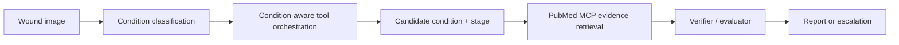

# WoundMind AI Agent Handoff

This document is for an AI coding agent that will continue WoundMind through many iterative/self-supervised development loops. Treat this file as the durable workspace brief and update it when the architecture or runtime contract changes.

## Current Snapshot

- Repository: `https://github.com/jxia622/WoundMind`
- Local repo path: `/Users/jackxia/Desktop/Python/DFU Project/WoundMind`
- Branch: `main`
- Current saved baseline before this handoff file: `dee8116` (`Load local env for agent runtime`)
- Safety status: research prototype only; not a medical device and not for clinical diagnosis.
- Primary local demo UI: `http://127.0.0.1:4173/`
- Primary API: `http://127.0.0.1:8000/`

If a future loop breaks the project, first try a normal revert of that loop's commit. To return to the pre-handoff baseline, use commit `dee8116`.

## Non-Negotiable Rules

- Do not commit `.env`, API keys, patient data, downloaded PDFs, model weights, demo runtime logs, case artifacts, or generated local caches.
- Do not print or store the OpenAI API key in source files, docs, tests, logs, README screenshots, or commit messages.
- Keep all clinical language framed as research support, staging verification, or escalation; do not present WoundMind as making a clinical diagnosis.
- Prefer small, reviewable commits. Each self-supervised loop should leave the repo either unchanged or in a validated commit.
- Do not silently fall back from PubMed MCP retrieval to the local clinical-doc database. Local retrieval is only for explicit offline development via `LITERATURE_RETRIEVAL_BACKEND=local`.

## Local Runtime

The user currently runs this on macOS. The known working Python environment is:

```bash
/Users/jackxia/Desktop/Python/venv-hw/bin/python
```

Core commands:

```bash
cd "/Users/jackxia/Desktop/Python/DFU Project/WoundMind"
make validate PYTHON=/Users/jackxia/Desktop/Python/venv-hw/bin/python
/Users/jackxia/Desktop/Python/venv-hw/bin/python -m pytest tests
make start-demo
make status-demo
make stop-demo
```

Manual API/frontend startup:

```bash
cd "/Users/jackxia/Desktop/Python/DFU Project/WoundMind"
source "/Users/jackxia/Desktop/Python/venv-hw/bin/activate"
uvicorn app.main:app --host 127.0.0.1 --port 8000

cd "/Users/jackxia/Desktop/Python/DFU Project/WoundMind/frontend/static-demo"
python -m http.server 4173 --bind 127.0.0.1
```

The app now loads local `.env` values from `app/agent/config.py`, and `scripts/dev/start_demo.sh` sources `.env` before starting the backend. `.env` is intentionally ignored by git.

## Environment Variables

Start from `.env.example`, then fill local secrets in `.env`.

Important variables:

```text
AGENT_MODEL_PROVIDER=openai
AGENT_MODEL=gpt-4o
VERIFIER_MODEL=gpt-4o
AGENT_SIMULATED_QA=true
OPENAI_API_KEY=<local secret; do not commit>

LITERATURE_RETRIEVAL_BACKEND=pubmed_mcp
PUBMED_MCP_PROJECT_PATH=../pubmed-clinical-mcp
PUBMED_MCP_PYTHON=/Users/jackxia/Desktop/Python/venv-hw/bin/python
PUBMED_MCP_TIMEOUT_SECONDS=45
PUBMED_MCP_MAX_RESULTS=8
```

The local `.env` should include `OPENAI_API_KEY`, but the key must never be copied into this document or any tracked file.

## External Dependencies And Model Artifacts

Large checkpoints are not committed. Required checkpoint layout:

```text
checkpoints/
  convnext_tiny_best.pt
  unetpp_efficientnet_b0_512.pt
  DFU_convnext_tiny/convnext_tiny_best.pt
  DFU_convnext_tiny_mask4/convnext_tiny_mask4_best.pt
  DFU_convnext_tiny_depth4/convnext_tiny_depth4_best.pt
  DFU_convnext_tiny_depth_mask5/convnext_tiny_depth_mask5_best.pt
  PI_convnext_tiny/convnext_tiny_pi_best.pt
  PI_convnext_tiny_mask4/convnext_tiny_mask4_pi_best.pt
  PI_convnext_tiny_depth4/convnext_tiny_depth4_pi_best.pt
  PI_convnext_tiny_depth_mask5/convnext_tiny_depth_mask5_pi_best.pt
```

Source workspace for local checkpoints:

```text
/Users/jackxia/Desktop/Python/DFU Project/Condition Classification/condition-classifier-deployment/checkpoints/
```

PubMed MCP project expected next to WoundMind:

```text
/Users/jackxia/Desktop/Python/DFU Project/pubmed-clinical-mcp
```

The WoundMind adapter calls the MCP server over stdio with:

```text
python -m pubmed_clinical_mcp.server
```

and invokes the MCP tool:

```text
search_and_fetch_pubmed
```

## Product Workflow

The static browser UI is intentionally a one-way workflow:

1. Upload wound image.
2. Verify image quality.
3. Classify wound condition.
4. Allow user condition override through a dropdown.
5. If condition is DFU or pressure injury, generate segmentation and depth.
6. Show light-blue mask overlay on the original image beside the relative depth map.
7. User clicks `Run full agent evaluation`.
8. Agent traces tool calls, retrieves PubMed evidence, runs severity model, extracts VLM visual evidence, runs a diagnostic-agent/evaluator loop, and returns a final report or escalation.

For non-DFU/non-pressure-injury conditions, the UI stops after classification because downstream condition-specific severity tools are not built yet.

## Architecture Map

FastAPI and model pipeline:

- `app/main.py`: FastAPI service, CORS, startup model loading, pipeline endpoints.
- `app/pipeline.py`: high-level deterministic image workflow; condition, mask, depth, severity.
- `app/models/condition_model.py`: ConvNeXt-Tiny 18-class condition classifier wrapper.
- `app/models/segmentation_model.py`: U-Net++ wound segmentation wrapper.
- `app/models/depth_model.py`: Depth Anything V2 relative depth wrapper.
- `app/models/severity_models.py`: DFU/PI severity model manager.
- `app/routing/severity_router.py`: chooses DFU/PI model variant based on condition, mask status, and depth status.

Agent layer:

- `app/routers/agent_router.py`: `POST /agent/analyze`, parses image/context/condition override.
- `app/agent/brain.py`: current WoundMind agent sequence, trace building, policy lookup, tool execution, visual extraction, severity draft, evaluator loop, case artifact write.
- `app/agent/tools.py`: tool facade for segmentation, depth, condition classification, severity, PubMed retrieval, simulated clinician Q&A.
- `app/agent/pubmed_mcp.py`: PubMed clinical MCP stdio adapter. Runtime evidence retrieval should go through this by default.
- `app/agent/vision.py`: OpenAI vision extractor for visible wound findings.
- `app/agent/evaluation.py`: diagnostic-agent/evaluator loop. The evaluator can request follow-up PubMed retrieval.
- `app/agent/verifier.py`: older single-call verifier module retained for compatibility, but the current full-agent path uses `app/agent/evaluation.py`.
- `app/agent/tool_policy.py`: condition policy loading and runtime tool plan construction.
- `app/agent/condition_policy_registry.json`: source of truth for condition-specific required tools and policy metadata.
- `app/agent/memory.py`: optional local Chroma/JSON clinical-doc fallback. Do not use unless backend is explicitly `local`.
- `app/agent/case_logger.py`: writes case artifacts under ignored `case_artifacts/`.

Frontend:

- `frontend/static-demo/index.html`: current primary browser demo UI.
- `frontend/static-demo/app.js`: one-way workflow and active trace behavior.
- `frontend/static-demo/styles.css`: current visual design.
- `frontend/streamlit_app.py`: older human-in-the-loop workflow, still present but not the primary demo.

Docs and assets:

- `README.md`: public-facing repo summary and diagrams.
- `docs/ARCHITECTURE.md`: architecture notes.
- `docs/CHECKPOINTS.md`: model artifact placement.
- `docs/DEVELOPMENT.md`: development notes.
- `docs/assets/woundmind_dfu_grade3_demo.gif`: README demo GIF.
- `docs/assets/woundmind_dfu_grade3_demo.webm`: README demo video.

## API Surface

Important endpoints:

```text
GET  /health
POST /validate-image
POST /predict-condition
POST /generate-mask
POST /generate-depth
POST /predict-severity
POST /analyze
POST /agent/analyze
POST /feedback
```

The full agent endpoint is `POST /agent/analyze` with multipart fields:

```text
image=<file>
patient_context=<optional JSON object string>
case_id=<optional string>
selected_condition=<optional classifier label override>
```

Sample manual full-agent test:

```bash
curl -sS -X POST http://127.0.0.1:8000/agent/analyze \
  -F 'image=@/Users/jackxia/Desktop/Python/DFU Project/Data/03-Diabetic_Foot_Ulcers_(DFU)/Grade 3/d06_411.jpg' \
  -F 'selected_condition=Diabetic_Foot_Ulcers_(DFU)' \
  > /tmp/woundmind_agent.json
```

Then inspect:

```bash
/Users/jackxia/Desktop/Python/venv-hw/bin/python - <<'PY'
import json
from pathlib import Path
payload = json.loads(Path('/tmp/woundmind_agent.json').read_text())
print(payload.get('case_id'))
print([chunk.get('doc_id') for chunk in payload.get('retrieved_chunks', [])])
print(payload.get('output', {}).get('verifier_result'))
print(payload.get('output', {}).get('flags', []))
PY
```

Expected evidence chunks should be PMID-backed, for example `PMID:...`, not local document IDs.

## Current Validation State

Recent verified commands:

```bash
make validate PYTHON=/Users/jackxia/Desktop/Python/venv-hw/bin/python
/Users/jackxia/Desktop/Python/venv-hw/bin/python -m pytest tests
curl -fsS http://127.0.0.1:8000/health
curl -fsS http://127.0.0.1:4173/
```

Known recent full-agent behavior on sample image:

- Image: `/Users/jackxia/Desktop/Python/DFU Project/Data/03-Diabetic_Foot_Ulcers_(DFU)/Grade 3/d06_411.jpg`
- Condition override: `Diabetic_Foot_Ulcers_(DFU)`
- PubMed MCP returned PMID-backed chunks.
- With OpenAI verifier enabled, verifier may return `UNCERTAIN` if PubMed abstracts do not explicitly support the exact Grade 3 staging criteria.
- Without OpenAI key, deterministic fallback may pass if a retrieved chunk contains direct stage/grade terms. This is a fallback, not the desired final verifier behavior.

## Current Gaps And High-Value Loop Targets

Prioritize these before broad refactors:

1. Improve PubMed evidence query quality for exact staging criteria.
   - Current query `"{condition} {stage} staging criteria"` can retrieve articles about outcomes or recurrence rather than the actual Wagner/NPIAP criteria.
   - Add condition-specific query templates for DFU Wagner grades and pressure injury stages.
   - Consider calling `fetch_pmc_full_text` when the ranked abstract is insufficient and PMCID is available.

2. Improve verifier contract and evidence packaging.
   - The OpenAI verifier should distinguish "retrieval insufficient" from "stage wrong".
   - Include citation metadata in a structured field instead of only embedding it in `DocumentChunk.text`.
   - Avoid suppressing severity purely because PubMed abstracts are underspecified; the UI should explain evidence insufficiency clearly.

3. Harden the VLM visual evidence extraction step.
   - `app/agent/vision.py` now calls an OpenAI vision model with the wound image when `OPENAI_API_KEY` is configured.
   - Next target: make visual findings more structured for exposed tendon/bone, necrosis/gangrene, infection signs, and image-quality caveats.

4. Strengthen the agent/evaluator loop.
   - `app/agent/evaluation.py` now alternates diagnostic-agent proposals and evaluator checks.
   - Next target: make evaluator follow-up retrieval more condition/stage-specific and let it request additional VLM extraction when needed.

5. Expand beyond DFU and pressure injury.
   - Other condition classes are classified but downstream severity tools and clinical references are mostly placeholders.
   - Use `condition_policy_registry.json` as the source of truth when adding condition-specific tools.

6. Add stronger automated tests.
   - Mock PubMed MCP integration tests.
   - Endpoint tests for `/agent/analyze`.
   - UI flow tests for static demo.
   - Regression tests for condition override, non-DFU stop behavior, and PubMed-not-local retrieval.

7. Clean up demo/runtime ergonomics.
   - `make start-demo` assumes `.venv/bin/python` unless `PYTHON_BIN` is set. On this machine `venv-hw` is the known working environment.
   - Consider documenting or auto-detecting the correct interpreter without breaking portable setup.

8. Production safety work remains unbuilt.
   - Authentication, authorization, PHI-safe storage, audit logging, monitoring, clinical validation, calibration review, and clinician sign-off workflow are not implemented.

## Loop Protocol For Future AI Agents

Use this process for each self-supervised loop:

1. Read this handoff, `README.md`, and the specific files touched by the planned change.
2. Run `git status --short`. If there are uncommitted user changes, preserve them and do not revert them.
3. Define one narrow objective.
4. Make the smallest code/doc change that moves that objective.
5. Run at least:

```bash
make validate PYTHON=/Users/jackxia/Desktop/Python/venv-hw/bin/python
/Users/jackxia/Desktop/Python/venv-hw/bin/python -m pytest tests
```

6. For UI/API changes, also run the local demo and test the affected endpoint or browser workflow.
7. If the loop is good, commit with a concrete message.
8. If the loop fails and cannot be fixed quickly, revert only the loop's own changes and write down what failed.

Never leave the repo in a half-edited state after a loop unless the user explicitly asks to pause there.

## Useful Git Commands

```bash
git status --short
git log --oneline -10
git diff --check
git diff --stat
git add <files>
git commit -m "<specific message>"
git push origin main
```

Rollback examples:

```bash
# Revert a single bad commit while preserving later history:
git revert <commit>

# Inspect the pre-handoff baseline:
git show --stat dee8116
```

Do not use `git reset --hard` unless the user explicitly requests it.

## Current Mental Model

WoundMind is not just a classifier UI. The intended product is an auditable diagnostic-assistant agent:



The public story should stay aligned with the actual runtime. If a diagram says a component exists, either wire it in or clearly label it as planned.
