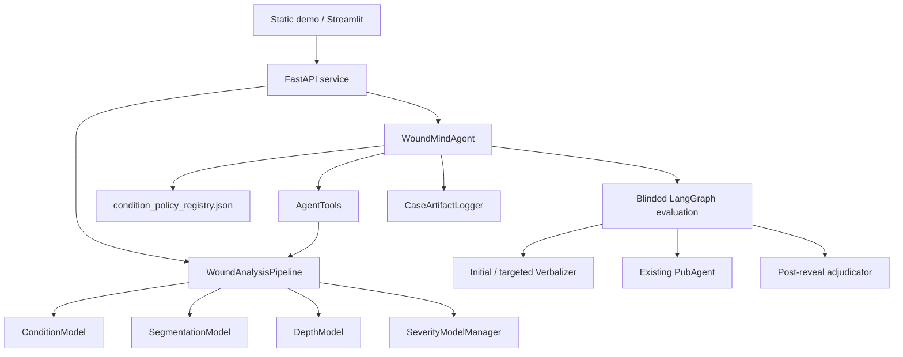
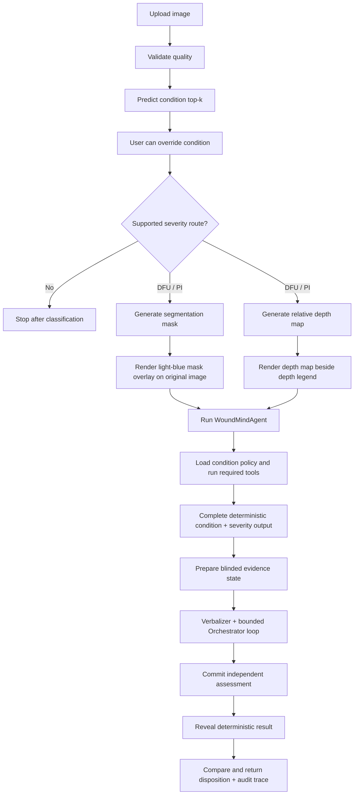

# Architecture

WoundMind is organized as a diagnostic assistant around a deterministic tool pipeline. The current static demo exposes a one-way review workflow: image quality verification, condition classification with optional override, side-by-side segmentation/depth review, and a full diagnostic-agent evaluation with trace and evidence metadata.

## System Components

## Runtime Flow

1. The API loads `WoundAnalysisPipeline` at startup.
2. The uploaded image is validated and normalized to RGB.
3. The condition classifier returns top-k condition probabilities and confidence metadata.
4. The static demo exposes the condition as a dropdown so a reviewer can override the model label before downstream routing.
5. DFU and pressure-injury routes continue to segmentation, depth, severity routing, and agent evaluation; unsupported conditions stop after classification.
6. Segmentation is shown as a light-blue overlay on the original wound image; the relative depth map is shown beside the depth legend.
7. After deterministic inference completes, the evaluator receives only wound evidence. Structured Orchestrator actions can ask the Verbalizer for case-specific facts or the existing PubAgent for clinical evidence.
8. The evaluator commits and locks its independent assessment before the deterministic condition, stage, and confidence are revealed.
9. Adjudication returns `SUPPORTED`, `FLAGGED`, or `INSUFFICIENT_EVIDENCE`; the full graph state is checkpointed in process and its audit record is persisted with the case artifact.

## Agent Boundary

The current agent layer is deliberately conservative:

- It can run without an LLM key, in which case the independent result is conservatively `INSUFFICIENT_EVIDENCE`.
- Tool execution remains deterministic and auditable.
- Clinical-literature questions are delegated only to the existing PubAgent interface.
- The simulated Q&A helper only answers from provided context.
- Conditions outside the currently implemented DFU/pressure-injury severity routes are not forced through unsupported staging tools.

OpenAI-backed Verbalizer, Orchestrator, and adjudicator calls use schema-enforced outputs. Blinded contexts have no model-result fields, and the independent-assessment digest is checked after reveal. See [EVALUATION_ARCHITECTURE.md](EVALUATION_ARCHITECTURE.md).

## Model Artifacts

The repository tracks model-loading code and checkpoint placement docs, not the binary checkpoints. See [CHECKPOINTS.md](CHECKPOINTS.md) for the expected directory layout.
